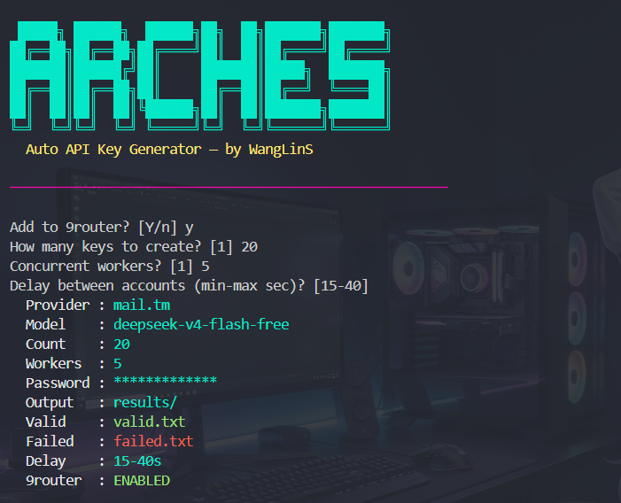

# Auto API Key Generator

> R4 Coder — by WangLinS

Automated tool to create R4 Coder accounts, generate API keys, validate them, and optionally bulk-add valid keys to a **9Router** "OpenAI Compatible" provider.

> ⚠️ **Educational & research use only.** Use at your own risk — you are solely responsible for compliance with each service's ToS and all applicable laws. See [Disclaimer](#disclaimer).

<div align="center">



[](https://www.typescriptlang.org/)
[](https://nodejs.org/)
[](https://github.com/wanglinsaputra/arches/blob/main/LICENSE)

</div>

## Features

- **Auto signup** with temp mail (Mail.tm)
- **Auto email verification** (extracts verification link from the inbox)
- **API key creation** via the R4 Coder dashboard RPC
- **Key validation** against a live model (`deepseek-v4-flash-free-free` default)
- **Multi-worker** concurrent generation
- **Progress bar** with real-time counters
- **Resume support** — existing keys in `valid.txt` / `failed.txt` are skipped
- **9Router integration** — optional bulk-add of valid keys to the `OpenAI Compatible` node (creates the node if missing, never duplicates)

## Requirements

- Node.js **>= 20** (native `fetch`, no network lib needed)
- npm

## Install

```bash
npm install
```

## Quick Start

```bash
cp .env.example .env      # optional; only needed for 9Router
npm run dev               # interactive wizard
```

Or build and run:

```bash
npm run build
npm start
```

### Interactive Wizard

Running without flags starts an interactive setup — it asks before anything runs:

```text
Add to 9router? [Y/n]
How many keys to create? [1]
Concurrent workers? [1]
Delay between accounts (min-max sec)? [15-40]
```

Press Enter to accept the default. When stdin is not a terminal (e.g. piped), the wizard is skipped and CLI flags / defaults are used.

## CLI Options

| Flag | Description | Default |
|------|-------------|---------|
| `-c, --count <n>` | Number of keys to create | `1` |
| `-w, --workers <n>` | Concurrent workers | `1` |
| `-p, --provider <name>` | Temp mail provider (`mail.tm`) | `mail.tm` |
| `-m, --model <id>` | Model used to validate keys | `deepseek-v4-flash-free-free` |
| `--password <pw>` | Account password | `WangLinS2026!` |
| `--output-dir <dir>` | Directory for result files (created if missing) | `results` |
| `--valid <file>` | Valid keys file (inside output-dir) | `valid.txt` |
| `--failed <file>` | Failed keys file (inside output-dir) | `failed.txt` |
| `--delay <min-max>` | Delay between accounts (seconds) | `15-40` |
| `--router9` | Enable 9Router auto-add | off |
| `--no-router9` | Disable 9Router auto-add | — |

## Examples

```bash
# Interactive wizard — prompts for count, workers, delay, 9router
npm run dev

# Create 10 keys with 3 workers
npm run dev -- -c 10 -w 3

# Custom password and delay
npm run dev -- -c 20 --password MyS3cret! --delay 20-50

# Output to custom files
npm run dev -- -c 5 --output-dir results --valid good.txt --failed bad.txt

# With 9Router sync enabled
npm run dev -- -c 5 --router9
```

When `--router9` is not passed, the CLI asks interactively:

```text
Add to 9router? [y/N]
```

## 9Router Integration

### Configuration (`.env`)

```env
ROUTER9_URL=http://172.22.144.1:20128
ROUTER9_PASS=<your-router9-password>
```

- `ROUTER9_PASS` is **never** printed, logged, or committed.
- Integration is **disabled** when either variable is missing — existing behavior is unchanged.

### Behavior

When enabled, after key generation the tool:

1. **Authenticates** to 9Router (`POST /api/auth/login`).
2. **Finds** the `OpenAI Compatible` node (`GET /api/provider-nodes`).
3. **Creates** it if absent (never duplicates).
4. **Bulk-adds** each valid key as a connection on that node, skipping duplicates and continuing on individual failures.

```text
9router integration: ENABLED
✓ Existing OpenAI Compatible node found
Using existing node (coder.r4.chat)
✓ Synced: 8
⚠ 9router failed: 2
```

9Router sync failures never fail the main key-generation flow.

## Output Format

Results are written to the output directory (default `results/`, auto-created). Existing files are appended to; existing keys are skipped.

**results/valid.txt** — working API keys:

```
Alex1234|coder_abc123...
```

**results/failed.txt** — non-working keys:

```
Sam5678|coder_xyz789...
```

## Development

```bash
npm run build        # type-check + compile to dist/
npm test             # run unit tests (vitest)
npm run dev          # run via tsx
```

## Project Layout

```
src/
├── index.ts      # CLI entry + orchestration
├── config.ts     # .env / config loading
├── banner.ts     # WangLinS banner + colors
├── prompt.ts     # interactive y/N prompt
├── tempmail.ts   # temp mail providers (Mail.tm)
├── r4client.ts   # R4 Coder API client
├── router9.ts    # 9Router client (nodes + connections)
├── sync.ts       # 9Router sync orchestration
└── utils.ts      # helpers
tests/
└── router9.test.ts
```

## Security

- No secrets hardcoded — everything comes from CLI flags or `.env`.
- `.env` is git-ignored.
- 9Router password is redacted from all error messages.
- Generated keys (`valid.txt` / `failed.txt`) are git-ignored.

## License

[MIT](https://github.com/wanglinsaputra/arches/blob/main/LICENSE) — © 2026 WangLinS

## Disclaimer

> **Educational & research use only.**

This tool is provided **as-is**, for **educational, research, and personal-automation purposes only**. The author (**WangLinS**) assumes **no responsibility** for how this software is used.

By using this tool you agree that:

1. **You are solely responsible** for any accounts, API keys, or data you create or manage with it.
2. **You must comply** with the Terms of Service, Acceptable Use Policy, and all applicable laws of:
   - the services this tool interacts with (R4 Coder, temp-mail providers, 9Router),
   - your local jurisdiction, and
   - any jurisdiction where the services operate.
3. **You must not** use this tool for spam, fraud, abuse, credential misuse, unauthorized access, or any illegal activity.
4. Accounts and API keys generated in bulk may violate a service's Terms of Service and result in account suspension, IP blocking, or legal action — **that risk is entirely yours**.
5. The author is **not liable** for any damages, losses, bans, or legal consequences arising from the use or misuse of this software.
6. Temp-mail and third-party APIs may change, rate-limit, or shut down without notice. No uptime or functionality is guaranteed.

If you do not agree with these terms, **do not use this tool**.

---

_This project is not affiliated with, endorsed by, or connected to R4 Coder, 9Router, or any temp-mail provider._